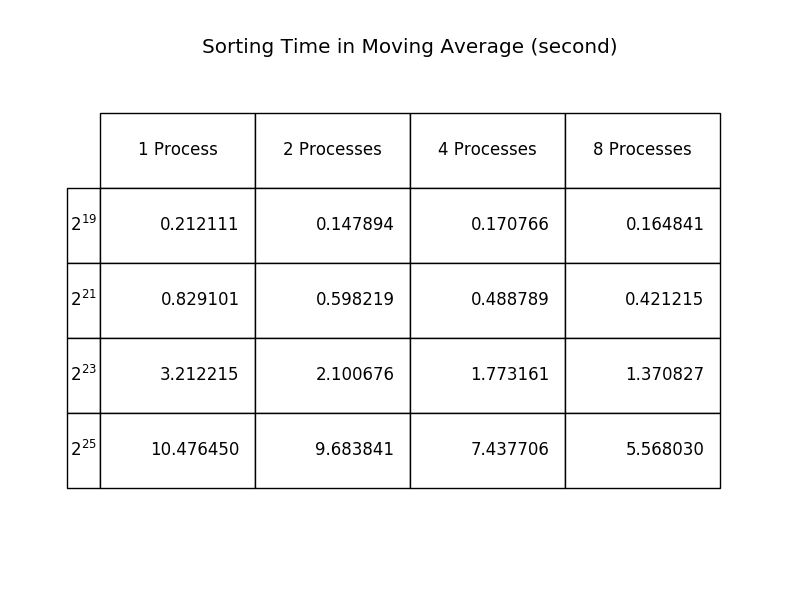
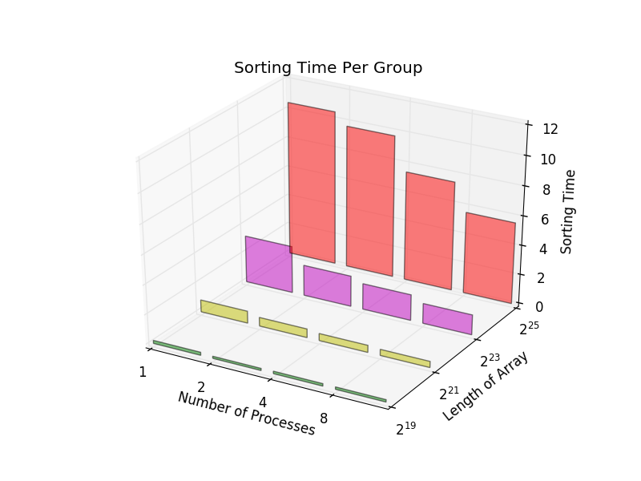

## Overview
MPI-based program that implements the parallel sorting by regular sampling
algorithm.

## Dependency
* C Compiler with ISO C99 Support (GCC **4.3+**).
* [CMake](https://cmake.org/) build system (**3.5+**).
* [Matplotlib](http://matplotlib.org/) plotting library.
* [MPICH](http://www.mpich.org/) message passing library (**3.2+**).
* [Python](https://www.python.org/) interpreter (**3.5+**).

**Ubuntu** (>= 16.04)  
```bash
sudo apt-get install build-essential cmake cmake-extras extra-cmake-modules libmpich-dev mpich python3-matplotlib
```

## Build Instructions
Change working directory to where the source directory resides and then issue:
```bash
mkdir build && cd build
cmake -DCMAKE_BUILD_TYPE=Release ..
make
```
Note the **"CMAKE_BUILD_TYPE=Release"** cache entry definition is necessary
if debug information is not needed (necessary for the
[plot.py](./tools/plot.py) script to work properly).

## Getting Started
To get usage help from the compiled program obtained from the last section:
```bash
cd src
mpiexec -n 1 ./psrs -h
```
For example, to obtain the running time of one process quick sort to be used as
a baseline for comparison:
```bash
mpiexec -n 1 ./psrs -l 10000000 -r 7 -s 10 -w 5
```
The *1* followed by the *-n* flag stands for how many processes to be launched;
the *10000000* followed by the *-l* flag stands for the length of the generated
array; the *7* that comes after *-r* stands for how many runs are required in
order to obtain the average; the *10* is the seed value supplied to the
*PRNG* of the array generation function; the last *5* argument for *-w*
flag denotes the window size for calculating moving average (number of runs
must not be less than window size; otherwise moving average can not be
calculated).

If needed, the average can be printed in binary form (double precision
floating-point value) by giving an extra *-b* flag - this is mostly useful for
piping the average directly into another program.


## Speedup Comparison
In order to get the speedup comparison graph using both array length and number
of processes as independent variables, run the python script resides in *tools*
subdirectory:
```bash
python3 tools/plot.py -p build/src/psrs -s speedup.png -t table.png -r runtime.png
```
The argument for *-p* flag is the path pointing to the *psrs* executable
compiled previously; *speedup.png*  is name of the speedup graph, *table.png*
is the name of the summary table for actual runtime; *runtime.png* is the name
of the bar chart visualization for comparing runtime grouped by array length.

Note that speedup ratios are calculated based on a collection of moving-average
runtimes with window size of 5 and 7 runs in total, which are the runtime
values shown in the figure ("Running Time in Moving Average") below.

A sample speedup graph obtained by following the above instructions:


The result is obtained from the following input table:

| Array Size | Number of Processes |
|:----------:|:-------------------:|
| 2²⁰        | 1 2 4 8 16          |
| 2²²        | 1 2 4 8 16          |
| 2²⁴        | 1 2 4 8 16          |
| 2²⁶        | 1 2 4 8 16          |
| 2²⁸        | 1 2 4 8 16          |

The actual runtime is recorded in the following table:


And a corresponding comparison bar chart:



## Credit
* The Matplotlib CMake module is borrowed from the source repository of
[FreeCAD](
https://github.com/FreeCAD/FreeCAD/blob/master/cMake/FindMatplotlib.cmake).


## License
Copyright © 2016 Jiahui Xie  
Licensed under the [BSD 2-Clause License][BSD2].  
Distributed under the [BSD 2-Clause License][BSD2].  

[BSD2]: https://opensource.org/licenses/BSD-2-Clause
